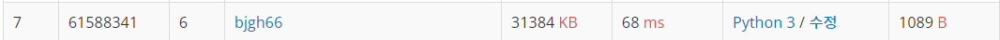

# 봄버맨

```python
import sys
input = sys.stdin.readline
R, C, N = map(int, input().strip().split())
board = [list(input().strip()) for _ in range(R)]

# 상우하좌
dr = [-1, 0, 1, 0]
dc = [0, 1, 0, -1]

def explode(x, y, bombs, board):
    bombs[x][y] = '.'
    for i in range(4):
        nx = x + dr[i]
        ny = y + dc[i]
        if (0 <= nx <= R-1) & (0 <= ny <= C-1):            
            bombs[nx][ny] = '.'

if N <= 1:
    for _ in range(R):
        print(''.join(board[_]))
# N이 짝수일 때
elif N%2 == 0:
    for _ in range(R):
        print('O'*C)

# N이 홀수일 때
else:
    # 3, 7, 11, ...초 일 때
    bombs1 = [['O']*C for _ in range(R)]
    for x in range(R):
        for y in range(C):
            if board[x][y] == 'O':
                explode(x, y, bombs1, board)
                
	# 5, 9, 13, ...초 일 때
    bombs2 = [['O'] * C for _ in range(R)]
    for x in range(R):
        for y in range(C):
            if bombs1[x][y] == 'O':
                explode(x, y, bombs2, bombs1)


    if N % 4 == 3:
        for _ in range(R):
            print(''.join(bombs1[_]))

    elif N % 4 == 1:
        for _ in range(R):
            print(''.join(bombs2[_]))

```
-----



처음으로 10위 안에 진입했다🤩 언빌리버블...!👀

