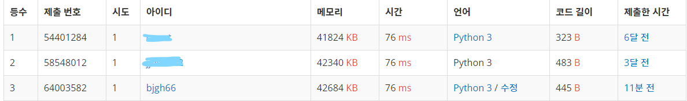

# 왕복

```python
import sys
input = sys.stdin.readline
N, K = map(int, input().strip().split())
distance_lst = list(map(int, input().strip().split()))

total_distance = sum(distance_lst)
temp = K % total_distance
if (K//total_distance)%2:
    for i in range(N-1, -1, -1):
        temp -= distance_lst[i]
        if temp < 0:
            print(i+1)
            break

else:
    for i in range(N):
        temp -= distance_lst[i]
        if temp < 0:
            print(i + 1)
            break
```

---



3등이닷ㅎㅎㅎ 제출한 사람이 1484명이라 얼떨결에 상위권에 진입한 것 같은데 그래도 기분 좋다ヽ(✿ﾟ▽ﾟ)ノ

